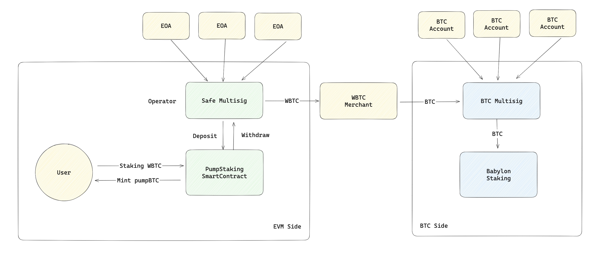
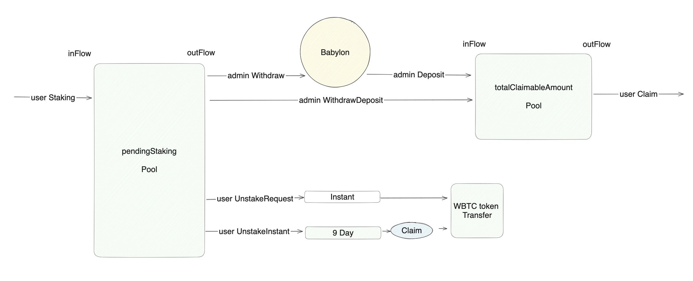

# PumpBTC

PumpBTC is a contract that allows users to stake Wrapped Bitcoin (e.g. WBTC, sBTC, BTCB) into an EVM contract and earn rewards in BTC, which are staked in Babylon. The process is shown in the figure below:



The project facilitates both standard and instant unstake options with associated fees. This README provides detailed instructions on deployment, configuration, and the usage of contract functions.

## Deployment

### Setup Environment

Copy the `.env.example` file to `.env` and fill in the required values.

```env
PRIVATE_KEY_ADMIN="<your private key>"
ADDRESS_ADMIN="<your wallet address>"
API_ETHERSCAN="<etherscan api (can be empty)>"
RPC_SEPOLIA="<sepolia network rpc>"
```

### Build & Deploy

1. Install dependencies by running:

   ```bash
   yarn
   ```

2. Compile the contracts and run the test:

   ```bash
   npx hardhat test
   ```

3. Deploy the contracts:

   ```bash
   npx hardhat run ./scripts/deploy.ts --network sepolia
   ```
    Remember to finish the manual steps in the deployment script. See `./scripts/deploy.ts` for details.

4. Upgrade the contracts(optional):

   ```bash
   npx hardhat run ./scripts/upgrade.ts --network sepolia
   ```


## Contract Overview

### Theory

Users deposit Wrapped BTC into our EVM contract, from which the operator manually exchanges Wrapped BTC for BTC daily and deposits it into Babylon. This amount is referred to as `X`.

When a user requests to unstake Wrapped BTC, the operator withdraws BTC from Babylon, which takes approximately 7 days, and then exchanges it for Wrapped BTC over the next day, delivering it to the user by date `T+10`. This amount is referred to as `Y`.

Users can also request an instant unstake, receiving Wrapped BTC immediately from other users' stakes that have not yet been exchanged for BTC, subject to an extra fee. This amount is referred to as `Z`, and must satisfy `Z < X`.

The assets flow is shown in the figure below:



### Contracts and ABI

Upon staking Wrapped BTC, our contract mints pumpBTC for the user.

- **pumpBTC**: An ERC20 token with 8 decimals.
- **WBTC**: The mainnet address is [here](https://etherscan.io/token/0x2260fac5e5542a773aa44fbcfedf7c193bc2c599). A test version with 8 decimals will be deployed on testnet.
- **pumpStaking**: The main staking contract containing several functions and events.

## Main Contract Functions

Note: All quantity-related variables are in pumpBTC decimals (8 decimals).

### View Functions

- `totalStakingAmount`: Total amount of BTC currently staked.
- `totalStakingCap`: Maximum cap for BTC staking.
- `totalRequestedAmount`: Total amount of BTC requested for unstake, not yet claimed.
- `totalClaimableAmount`: Total amount of BTC available for claiming.
- `pendingStakeAmount`: Amount staked today minus amount instantly unstaked today (`X - Z`).
- `collectedFee`: Collected fees (in WBTC, 8 decimals).
- `operator`: Address able to withdraw or deposit BTC to the contract.
- `instantUnstakeFee`: Fee rate for instant unstake, default is 300 (3%).
- `pendingUnstakeTime`: Timestamp for a user's unstake request in a specific date slot.
- `pendingUnstakeAmount`: Amount requested for unstake by a user in a specific date slot.

### Admin Write Functions

- `setStakeAssetCap`: Set the staking cap.
- `setInstantUnstakeFee`: Set the fee rate for instant unstake.
- `setOperator`: Set the operator address for withdrawals and deposits.
- `collectFee`: Transfer collected fees out of the contract.
- `withdraw`: Withdraw `X - Z` WBTC from the contract, convert to BTC, and stake to Babylon.
- `deposit`: Deposit WBTC equivalent to the unstake request amount `Y` after 10 days.
- `withdrawAndDeposit`: Combine the withdraw and deposit operations.

### User Write Functions

- `stake`: Stake a specified amount of WBTC (8 decimals).
- `unstakeRequest`: Request to unstake a specified amount of WBTC.
- `claimSlot`: Claim unstaked WBTC for a specific slot after the 10-day period.
- `claimAll`: Claim all unstaked WBTC after the 10-day period.
- `unstakeInstant`: Instantly unstake a specified amount of WBTC, subject to a fee.

### Events

Each function generally has corresponding events, detailed in the ABI. pumpBTC transfers follow standard ERC20 transfer events.

## Additional Information

For more details on date slots and the 10-day unstake cycle, please refer to the in-depth contract documentation and comments within the ABI.
